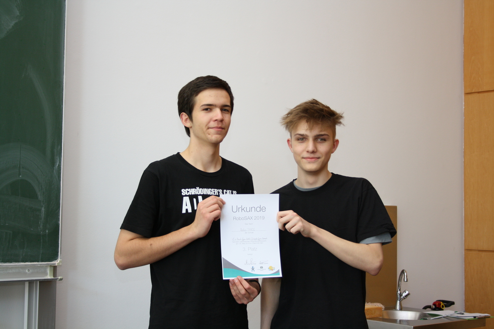
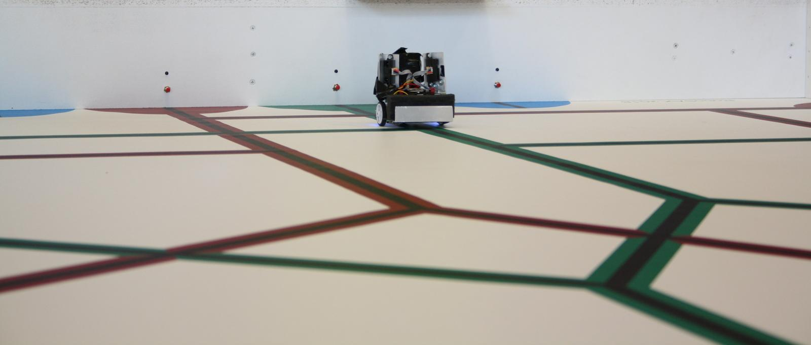

# RoboSAX 2018-2019

### Aufgabenstellung
Siehe [RoboSAX Webseite](https://robosax.de/2019).

Anfangs haben wir den [AluBot](../2016_AluBot/) der RoboAG verwendet.
Kurz vor dem Wettbewerb haben wir uns dann aber umentschieden und auf die vertraute [Hardware des Vorjahres](../2017-2018_RoboSAX) gesetzt.

### Wettbewerbstag
Am Wettbewerbstag wurde unser Team zusammengelegt mit dem Team aus Stollberg.

Team RoboTARS:
+ Franz Agsten (Team RoboAG)
+ Maximilian Kraeft (Team TARS)

Der finale Quelltext ist [hier](Software/RoboTARS/) zu finden.

### Letzte Vorbereitung
+ Alex Feilke
+ Franz Agsten

Hier findet ihr unseren [Quelltext](Software/Vorbereitung/).

#### Blog
Unser Siegerteam vom Vorjahr hat dieses bei Zeiten angefangen die diesjährige Aufgabe zu lösen.
Um euch einen kleinen Einblick zu geben, versuchen wir unsere Arbeiten und Fortschritte am AluBot zu [dokumentieren](Blog/):
+ Janek Neugebauer
+ Christoph Männel
+ Felix Krüger
+ (Leonhard Nagel)
