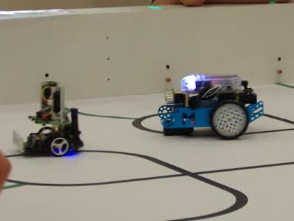

# RoboSAX 2021-2022

Dieses Jahr konnte die RoboAG zwei Teams zum RoboSAX entsenden: \
Ein Team nutzte unseren [3Pi aus den Vorjahren](../2017-2018_RoboSAX). \
Das andere Team nutzte unseren neu angeschafften mbot.

### Aufgabenstellung

### Die 3 Pi’s
Roboter: [3Pi von Pololu](https://www.pololu.com/3pi)

Klasse : 7.-12. Klasse

Teammitglieder
+ Janek Neugebauer
+ Jasper Bauerschaper
+ Daniel Bart

**1. Platz** beim RoboSAX 2022

[Quelltext](Software/3Pis/) für avr-gcc

### Die CoTiFenRobos
Roboter: [mbot von makeblock](https://www.makeblock.com/mbot)

Klasse : 6. Klasse

Teammitglieder
+ Cora Neugebauer
+ Ferdinand Seibt
+ Timon Kraft

**4. Platz** beim RoboSAX 2022

[Quelltext](Software/CoTiFenRobos/) für mblock IDE
