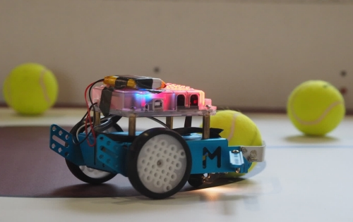
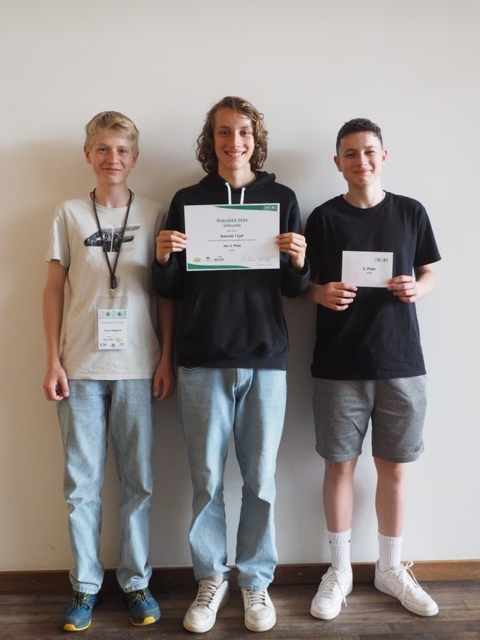
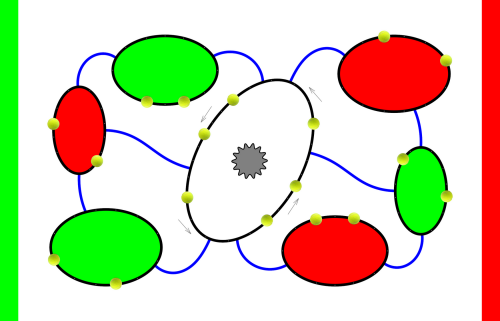
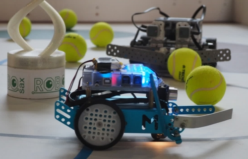
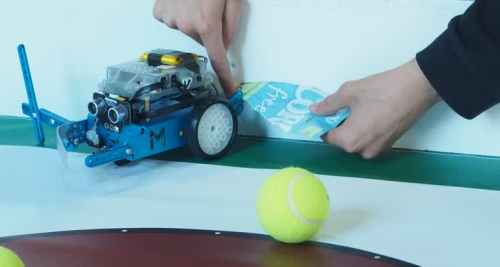

# RoboSAX 2023-2024

Wir haben in den letzten Jahren erste [Erfahrungen mit dem mbot](../2021-2022_RoboSAX#die-cotifenrobos) gesammelt.
Dieses Jahr haben wir angefangen den Roboter mit Arduino in C zu programmieren.

Am Ende haben wir es auf den **2. Platz** beim RoboSAX 2024 geschafft.

### Team "RoboAG 1 CpP"
+ Daniel Bart
+ Timon Kraft
+ Florian Schreiber
+ ein weiteres Mitglied

### Aufgabenstellung

### Roboter
+ Roboter: [mbot von makeblock](https://www.makeblock.com/mbot)
+ Quelltext: [C unter Arduino](Software/)
+ Erweiterungen
    - I²C-Farbsensor von [Adafruit](https://www.adafruit.com/product/1334)
    - 1,8Ah LiPo-Akku

Kommentar der Entwickler: \
Damit das Programm seine volle Leistungsstärke und Funktionsfähigkeit entfalten kann,
ist eine Corny Verpackung mehr als notwendig.

